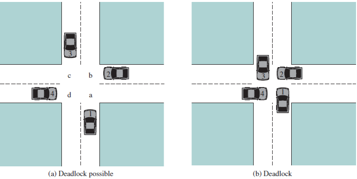

# MarkDuang	
   MarkDuang是一款轻量级的markdown编辑器。实现了markdown的大部分基础语法，并支持语法高亮。
- 支持标准Markdown语法
- 支持Github风格的render

### 配置
本项目的配置仅需导入一个额外的包**itextpdf-5.5.5.jar**即可

### 功能介绍

标题支持5级标题
# Heading1
## Heading2
### Heading3
#### Heading4
##### Heading 5
   以及标题中带链接
# Heading1 [Heading link](https://github.com/horseee "heading link")
## Heading2 [Heading link](http://github.com/horseee "heading link")
### Heading3 [Heading link](http://github.com/horseee "heading link")
#### Heading4 [Heading link](http://github.com/horseee "heading link")
##### Heading5 [Heading link](http://github.com/horseee "heading link")

## 字体效果和横线                
~~删除~~
*斜体字*      _斜体字_
**粗体**  __粗体__
***粗斜体*** ___粗斜体___

### 引用

> 引用文本 

引用的行内混合
                    
> 引用：可以插入**粗体字**用同样的方法

### 锚点与链接 

[普通链接](https://github.com)

### 插入代码

#### 缩进

缩进四个空格，也做为实现类似**pre**预格式化文本(Preformatted Text)的功能。

    <?php
        echo "Hello world!";
    ?>
    
缩进一张表格（缩进优先级高于表格，表格将不显示）

    | First Header  | Second Header |
    | ------------- | ------------- |
    | Content Cell  | Content Cell  |
    | Content Cell  | Content Cell  |

#### 代码块

```
function test(){
	console.log("Hello world!");
}
 
(function(){
    var box = function(){
        return box.fn.init();
    };

    box.prototype = box.fn = {
        init : function(){
            console.log('box.init()');

			return this;
        },

		add : function(str){
			alert("add", str);

			return this;
		},

		remove : function(str){
			alert("remove", str);

			return this;
		}
    };
    
    box.fn.init.prototype = box.fn;
    
    window.box =box;
})();

var testBox = box();
testBox.add("jQuery").remove("jQuery");
```

### 图片 Images


> 从网络上获取图片



> 图为：操作系统实验1

图片加链接 (Image + Link)：

(https://pandao.github.io/editor.md/examples/images/7.jpg "李健首张专辑《似水流年》封面")

> 图为：李健首张专辑《似水流年》封面

### 列表

#### 列表(-)
                
- 列表一
- 列表二
- 列表三
     
#### 列表(*)

* 列表一
* 列表二
* 列表三

#### 列表（加号和嵌套）(+)
                
+ 列表一
+ 列表二
    + 列表二-1
    + 列表二-2
    + 列表二-3
+ 列表三
    * 列表一
    * 列表二
    * 列表三
                    
### 绘制表格

| 项目        | 价格   |  数量  |
| --------   | -----:  | :----:  |
| 计算机      | $1600   |   5     |
| 手机        |   $12   |   12   |
| 管线        |    $1    |  234  |
                    
First Header  | Second Header
------------- | -------------
Content Cell  | Content Cell
Content Cell  | Content Cell 

| First Header  | Second Header |
| ------------- | ------------- |
| Content Cell  | Content Cell  |
| Content Cell  | Content Cell  |

| Function name | Description                    |
| ------------- | ------------------------------ |
| help()      | Display the help window.       |
| destroy()   | **Destroy your computer!**     |

| Left-Aligned  | Center Aligned  | Right Aligned |
| :------------ |:---------------:| -----:|
| col 3 is      | some wordy text | $1600 |
| col 2 is      | centered        |   $12 |
| zebra stripes | are neat        |    $1 |

| Item      | Value |
| --------- | -----:|
| Computer  | $1600 |
| Phone     |   $12 |
| Pipe      |    $1 |
               
### 备注
需要注意，所有的标识符后面都需要跟一个空格（除了**和__），不然无法正确的显示样式和颜色。
readme.pdf为本文档的测试结果 。  
本readme中部分的图片和测试用例引用了http://pandao.github.io/editor.md/中的内容。在此特别感谢。
                
### End